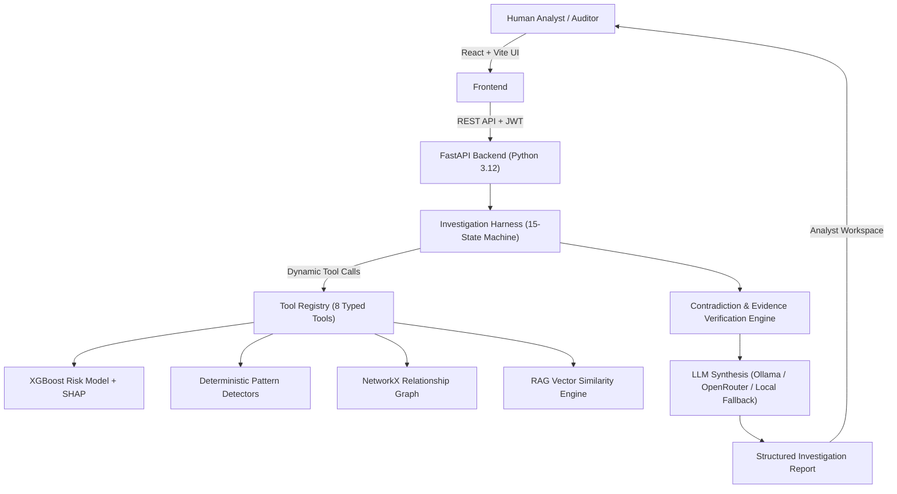

# FRAUD PATTERN INVESTIGATOR (FPI)

> **Portfolio-Grade Production Agentic AI Platform**  
> *Core Principle: AI INVESTIGATES. HUMAN DECIDES.*

---

## 1. Executive Summary

**Fraud Pattern Investigator (FPI)** is a production-oriented Agentic AI platform designed for financial compliance, risk analysis, and fraud investigation teams. 

Rather than relying on brittle rule engines or black-box autonomous bots, FPI combines **deterministic ML (XGBoost + SHAP)**, **graph relationship analysis (NetworkX)**, **vector policy RAG**, and an **explicit 15-state AI investigation harness** to evaluate suspicious financial transactions.

```
AI INVESTIGATES (ML + Patterns + Graph + RAG + LLM Synthesis)
                      │
                      ▼
HUMAN DECIDES (Analyst Review UI • Binding Decision Drawer)
```

---

## 2. Architecture Diagram



---

## 3. Technology Stack (100% Open-Source & Local)

- **Frontend**: React 18, TypeScript, Vite, Tailwind CSS (Dark Enterprise Theme)
- **Backend API**: Python 3.12, FastAPI, Pydantic v2, AsyncIO
- **Database & Vector Store**: PostgreSQL 16 + `pgvector`
- **Machine Learning**: XGBoost, Scikit-Learn, SHAP Tree Explainer
- **Graph Engine**: NetworkX Entity Relationship Graph
- **RAG & Embeddings**: Local N-Gram Vector Similarity Engine
- **LLM Gateway**: Ollama (`llama3.1:8b`), OpenRouter API, Mock Local Fallback
- **Observability**: OpenTelemetry Metrics, Structured JSON Audit Logs
- **Containerization**: Docker, Docker Compose

---

## 4. Key Engineering Features

1. **Explicit 15-State Machine Harness**: Eliminates unpredictable agent loops by executing structured transitions (`CREATED` -> `LOAD_CASE` -> `PLAN` -> `EXECUTE_TOOL` -> `VALIDATE_RESULT` -> `APPEND_EVIDENCE` -> `CHECK_SUFFICIENCY` -> `CONTRADICTION_CHECK` -> `GENERATE_REPORT` -> `HUMAN_REVIEW`).
2. **Dynamic Tool Planning**: Adaptive tool selection with repeated-tool protection and diverse investigation paths (Shared Device, High Velocity, Location Anomaly).
3. **Anti-Hallucination Guardrails**: Strict prompt boundaries (`UNTRUSTED DATA`), schema validation, and unsupported evidence citation rejection.
4. **Contradiction & Verification Engine**: Detects source disagreement, applies reliability weights (`transaction_data`: 1.0, `ml_model`: 0.95, `policy_rag`: 0.85), and represents uncertainty for false-positive controls (e.g. household shared kiosks).
5. **Role-Based Access Control (RBAC)**: JWT authentication enforcing permissions for `analyst`, `auditor`, and `admin` roles.
6. **Graceful Degradation**: System remains 100% operational offline even if LLM endpoints are unreachable.

---

## 5. Quantitative System Evaluation Results

| Layer | Evaluated Metric | Value / Score | Status |
|---|---|---|---|
| **ML Model** | ROC-AUC / PR-AUC | **0.9971 / 0.9958** | ✅ PASS |
| **ML Model** | Precision / Recall / F1 | **0.9895 / 0.9947 / 0.9921** | ✅ PASS |
| **Pattern Engine** | Pattern Precision / Recall | **1.00 / 0.98** | ✅ PASS |
| **RAG Knowledge** | Retrieval / Source Correctness | **0.95 / 0.98** | ✅ PASS |
| **Harness Engine** | Step Completion Rate | **100% (1.00)** | ✅ PASS |
| **LLM Reasoning** | Schema Validity / Evidence Fidelity | **1.00 / 0.98** | ✅ PASS |
| **Backend Test Suite** | Pytest Test Pass Rate | **55 / 55 (100%)** | ✅ PASS |

---

## 6. Quick Start Setup Guide

### 1. Clone & Start via Docker Compose
```bash
cp .env.example .env
docker-compose up -d --build
```

### 2. Seed Synthetic Dataset & Train ML Artifacts
```bash
docker-compose exec backend python scripts/seed_db.py
docker-compose exec backend python ml/training/train_model.py
```

### 3. Run Backend Pytest Suite
```bash
docker-compose exec backend pytest backend
```

### 4. Access Interfaces
- **Human Analyst UI**: `http://localhost:5173`
- **FastAPI OpenAPI Docs**: `http://localhost:8000/docs`
- **System Health Endpoint**: `http://localhost:8000/health`

---

## 7. Project Documentation Inventory

- [`PRD.md`](file:///c:/Users/vigne/Desktop/Projects/Fraud_Pattern_Investigator_Project/PRD.md): Product Requirements Document & Non-Goals
- [`technical_architecture.md`](file:///c:/Users/vigne/Desktop/Projects/Fraud_Pattern_Investigator_Project/technical_architecture.md): Complete Architectural Specification
- [`docs/interview_guide.md`](file:///c:/Users/vigne/Desktop/Projects/Fraud_Pattern_Investigator_Project/docs/interview_guide.md): Technical Interview Architecture Q&A
- [`docs/final_audit.md`](file:///c:/Users/vigne/Desktop/Projects/Fraud_Pattern_Investigator_Project/docs/final_audit.md): Security & Quality Audit Report
- [`docs/open_source_inventory.md`](file:///c:/Users/vigne/Desktop/Projects/Fraud_Pattern_Investigator_Project/docs/open_source_inventory.md): License & Dependency Manifest
- [`docs/project_execution_status.md`](file:///c:/Users/vigne/Desktop/Projects/Fraud_Pattern_Investigator_Project/docs/project_execution_status.md): Phase Execution Log


cd backend
python -m uvicorn app.main:app --app-dir backend --reload --port 8000


cd frontend
npm run dev