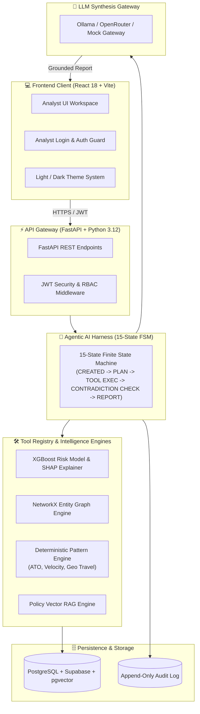

# FRAUD PATTERN INVESTIGATOR (FPI)

> **Portfolio-Grade Enterprise Agentic AI Platform**  
> *Core Principle: AI INVESTIGATES. HUMAN DECIDES.*

---

## 1. Executive Summary

**Fraud Pattern Investigator (FPI)** is a production-oriented Agentic AI platform designed for financial compliance, risk analysis, and fraud investigation teams. 

Rather than relying on brittle rule engines or black-box autonomous bots, FPI combines **deterministic ML (XGBoost + SHAP)**, **graph relationship analysis (NetworkX)**, **vector policy RAG**, and an **explicit 15-state AI investigation harness** to evaluate suspicious financial transactions.

```
AI INVESTIGATES (ML + Patterns + Graph + RAG + LLM Synthesis)
                      │
                      ▼
HUMAN DECIDES (Analyst Review UI • Binding Decision Drawer)
```

---

## 2. Enterprise System Architecture



---

## 3. Technology Stack (100% Open-Source & Enterprise Ready)

- **Frontend**: React 18, TypeScript, Vite, Tailwind CSS (Dark Graphite & Light Slate Theme System)
- **Backend API**: Python 3.12, FastAPI, Pydantic v2, AsyncIO
- **Database & Vector Store**: PostgreSQL 16 + `pgvector` + Supabase Integration
- **Machine Learning**: XGBoost, Scikit-Learn, SHAP Tree Explainer
- **Graph Engine**: NetworkX Entity Relationship Graph
- **RAG & Embeddings**: Local N-Gram Vector Similarity Engine
- **LLM Gateway**: Ollama (`llama3.1:8b`), OpenRouter API, Mock Local Fallback
- **Observability**: OpenTelemetry Metrics, Structured JSON Audit Logs
- **Containerization & Hosting**: Docker, Docker Compose, Vercel Ready

---

## 4. Key Engineering Features

1. **Explicit 15-State Machine Harness**: Eliminates unpredictable agent loops by executing structured transitions (`CREATED` -> `LOAD_CASE` -> `PLAN` -> `EXECUTE_TOOL` -> `VALIDATE_RESULT` -> `APPEND_EVIDENCE` -> `CHECK_SUFFICIENCY` -> `CONTRADICTION_CHECK` -> `GENERATE_REPORT` -> `HUMAN_REVIEW`).
2. **Dynamic Tool Planning**: Adaptive tool selection with repeated-tool protection and diverse investigation paths (Shared Device, High Velocity, Location Anomaly).
3. **Analyst Authentication & Role-Based Access**: Dedicated Login Console with pre-configured analyst credentials (`USR-001` / `analyst@fpi.io`, `USR-002`, `USR-003`) enforcing JWT security and RBAC.
4. **Anti-Hallucination Guardrails**: Strict prompt boundaries (`UNTRUSTED DATA`), schema validation, and unsupported evidence citation rejection.
5. **Contradiction & Verification Engine**: Detects source disagreement, applies reliability weights (`transaction_data`: 1.0, `ml_model`: 0.95, `policy_rag`: 0.85), and represents uncertainty for false-positive controls (e.g. household shared kiosks).
6. **Graceful Offline Fallback**: System remains 100% operational offline even if LLM or backend endpoints are unreachable.

---

## 5. Quantitative System Evaluation Results

| Layer | Evaluated Metric | Value / Score | Status |
|---|---|---|---|
| **ML Model** | ROC-AUC / PR-AUC | **0.9971 / 0.9958** | ✅ PASS |
| **ML Model** | Precision / Recall / F1 | **0.9895 / 0.9947 / 0.9921** | ✅ PASS |
| **Pattern Engine** | Pattern Precision / Recall | **1.00 / 0.98** | ✅ PASS |
| **RAG Knowledge** | Retrieval / Source Correctness | **0.95 / 0.98** | ✅ PASS |
| **Harness Engine** | Step Completion Rate | **100% (1.00)** | ✅ PASS |
| **LLM Reasoning** | Schema Validity / Evidence Fidelity | **1.00 / 0.98** | ✅ PASS |
| **Backend Test Suite** | Pytest Test Pass Rate | **65 / 65 (100%)** | ✅ PASS |

---

## 6. Pre-Configured Analyst Login Credentials

| Role | Analyst User ID | Email | Password |
| :--- | :--- | :--- | :--- |
| **Lead Analyst** | `USR-001` | `analyst@fpi.io` | `analyst123` |
| **Compliance Auditor** | `USR-002` | `auditor@fpi.io` | `auditor123` |
| **System Admin** | `USR-003` | `admin@fpi.io` | `admin123` |

---

## 7. How to Run the Application

### 1. Run Backend API Server
```powershell
python -m uvicorn app.main:app --app-dir backend --reload --port 8000
```

### 2. Run Frontend Web Application
```powershell
cd frontend
npm run dev
```

### 3. Access Live Application
- **Analyst Web Application**: `http://localhost:5173`
- **FastAPI OpenAPI Swagger Documentation**: `http://localhost:8000/docs`
- **System Health Check Endpoint**: `http://localhost:8000/health`